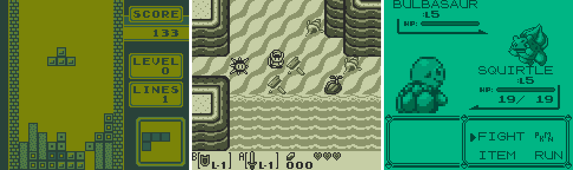

<!--
SPDX-FileCopyrightText: 2026 David Jolly <jolly.a.david@gmail.com>
SPDX-License-Identifier: MIT
-->

[](LICENSES/MIT.txt) [](https://builds.sr.ht/~dajolly/gb?)



## Install

```bash
git clone https://git.sr.ht/~dajolly/gb
cd gb
make
sudo make install
```

```bash
# The default installation directory is /usr/local
# To install into a different directory, redefine PREFIX
sudo make install PREFIX=/your/path
```

```bash
# To uninstall
sudo make uninstall
```

## Usage

```
Usage: gb [options] [file]

Options:
   -f, --fullscreen  Set window fullscreen
   -h, --help        Show help information
   -s, --scale       Set window scale
   -v, --version     Show version information
```

```bash
# Launch with a ROM file
gb rom.gb
# Launch with a fullscreen window
gb -f rom.gb
# Launch with a scaled window
gb -s <n> rom.gb
```

## Keybindings

|Button |Key        |Controller|
|:------|:----------|:---------|
|A      |X          |A         |
|B      |Z          |B         |
|Select |C          |Back      |
|Start  |Return     |Start     |
|Right  |Right-Arrow|Right-Dpad|
|Left   |Left-Arrow |Left-Dpad |
|Up     |Up-Arrow   |Up-Dpad   |
|Down   |Down-Arrow |Down-Dpad |

## Mappers

|Id   |Type                                       |Description         |
|:----|:------------------------------------------|:-------------------|
|0,8-9|[MBC0](https://gbdev.io/pandocs/nombc.html)|32KB ROM/8KB RAM    |
|1-3  |[MBC1](https://gbdev.io/pandocs/MBC1.html) |2MB ROM/32KB RAM    |
|5-6  |[MBC2](https://gbdev.io/pandocs/MBC2.html) |256KB ROM/512B RAM  |
|15-19|[MBC3](https://gbdev.io/pandocs/MBC3.html) |2MB ROM/32KB RAM/RTC|
|25-30|[MBC5](https://gbdev.io/pandocs/MBC5.html) |8MB ROM/128KB RAM   |

## License

Copyright (C) 2026 David Jolly <jolly.a.david@gmail.com>. Released under the [MIT License](LICENSES/MIT.txt).
